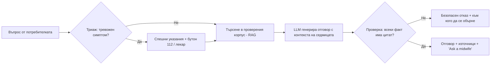
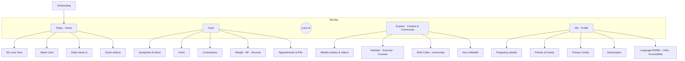

# Lunabump — продуктова концепция на мобилно приложение за бременност

> **Watch your little moon grow.**
> *Гледай как расте твоята малка луна.*

| | |
|---|---|
| **Документ** | Продуктова концепция (Product + UX/UI) |
| **Версия** | 1.0 · октомври 2026 |
| **Платформи** | iOS и Android (React Native + Three.js), web companion |
| **Език на продукта** | Английски (основен) · Български (първи превод при launch) |
| **Статус** | Концепция за валидиране, преди Discovery фаза |

---

## Съдържание

0. [Резюме (TL;DR)](#0-резюме-tldr)
1. [Основна концепция и уникално предимство (USP)](#1-основна-концепция-и-уникално-предимство-usp)
2. [Ключови функции](#2-ключови-функции)
3. [AI функции](#3-ai-функции)
4. [UI/UX и навигация](#4-uiux-и-навигация)
5. [Монетизация](#5-монетизация)
6. [Технологичен стек](#6-технологичен-стек)
7. [Пътна карта, KPI и рискове](#7-пътна-карта-kpi-и-рискове)

---

## 0. Резюме (TL;DR)

**Lunabump** е приложение за бременност, в което бебето присъства като **„жив“ 3D модел в реално време**, изграден с Three.js. Моделът расте ден след ден, реагира на ритниците, които майката отбелязва, и може да се персонализира с измерванията от видеозоните. Под визуалната част работи **AI асистентът „Luna“**. Той отговаря само по медицински насоки, винаги посочва източника и знае кога да каже „обадете се на лекар“. Приложението е **privacy-first**: здравните данни не се продават и няма рекламни тракери.

**Трите стълба на продукта:**

| Стълб | Какво означава | Ключова функция |
|---|---|---|
| **See** · Виж | Бременността се вижда, а не само се чете | 3D „Luna View“ в реално време, AR в реален размер, 4K портрет на седмицата |
| **Understand** · Разбери | Спокойни отговори с източници | AI „Luna“ с цитирани насоки, SafeScan, Scan Reader |
| **Together** · Заедно | Партньорът и семейството участват, а данните остават лични | Partner Mode, Family Circle, криптиран дневник |

---

## 1. Основна концепция и уникално предимство (USP)

### 1.1 Име: **Lunabump**

**Luna** (луна) + **bump** (разговорно на английски за „бременното коремче“).

- **Защо луна:** бременността трае около 280 дни, което е **10 акушерски лунни месеца по 28 дни**. В много култури още се казва „девет луни“. Луната е и нощна, спокойна и светеща, точно като 3D сцената, в която бебето „свети“ като малка луна в утробата.
- **Звучене:** кратко, игриво и лесно за произнасяне на английски и български („Лунабъмп“). Работи и като общностна марка: *Lunabump moms*, *Lunabump dads*, *Luna* (името на AI асистента).
- **Лого:** полумесец, чиято вътрешна извивка образува силуета на бременно коремче. Вътре е малка светеща точка (бебето). Иконата е тъмносин нощен градиент с топъл прасковен полумесец.

**Проверка за свободност (към 02.10.2026):**

| Проверка | Резултат |
|---|---|
| `lunabump.com` | Свободен (RDAP: не е регистриран) |
| `lunabump.app` | Свободен (RDAP: не е регистриран) |
| App Store / Google Play / търсачки | Не открих приложение с име „Lunabump“ |

> ⚠️ Това е техническа проверка, а не правна. Преди launch направете проучване за търговска марка в **EUIPO/TMview**, **USPTO** и **Патентното ведомство на РБ**. Регистрирайте марката в класове по Ницската класификация **9** (софтуер), **42** (SaaS) и **44** (здравни услуги). Запазете и social handle-ите (`@lunabump`).
>
> **Резервни имена:** *Lumbaby* (свободни .com и .app), *Orbelle* и *Lullora* (свободен само .app).

### 1.2 Какво прави Lunabump различно

**Позициониране в едно изречение:**
*Lunabump е единственото приложение за бременност, в което бебето ти е живо, интерактивно 3D присъствие, свързано с твоите собствени данни, с AI, който цитира медицински източници, и с поверителност по подразбиране.*

| Аспект | Типичен подход на пазара | Lunabump |
|---|---|---|
| **Визуализация на бебето** | Статични илюстрации или предварително рендерирани 3D модели (някои, като Pregnancy+, имат 3D модели, но без връзка с данните ти) | **3D в реално време** (Three.js): интерполира се **за всеки ден**, реагира на ритници и пулс, мащабира се по измерванията от видеозона |
| **Съдържание** | Едно и също за всички в дадена седмица | Персонализирано по седмица, симптоми, диета, рискови фактори и предпочитан тон |
| **AI** | Липсва или е общ чатбот | RAG само върху проверени насоки (WHO, ACOG, NICE, RCOG), **цитат към всеки отговор**, триаж на тревожни симптоми |
| **Партньор** | Една статия „за татковци“ | **Отделен Partner Mode** със синхронизация в реално време (споделен таймер на контракции, задачи, известия) |
| **Поверителност** | Рекламни SDK-та, споделяне с трети страни. Flo например сключва споразумение с FTC (2021) заради споделяне на здравни данни | **Без рекламни тракери**, E2E криптиран дневник, хостинг в ЕС, пълен експорт и изтриване с един бутон |
| **Тон** | Или клинично-сух, или прекалено „сладък“ | Топъл, спокоен и научно обоснован, с лек хумор и без плашене |
| **Чувствителни ситуации** | Рядко се мислят | Режим при загуба, абстрактен 3D режим без реалистичен плод, режим „без числа“ за теглото |

**Накратко за конкурентите:**

- **Flo:** силен в проследяването на цикъла. Бременността е разширение на основния продукт и няма собствена 3D идентичност.
- **What to Expect:** голяма библиотека със съдържание и силна общност, наследени от книгата. Моделът разчита на реклами и визуалният опит е по-скоро статичен.
- **Preggo и базовите тракери:** покриват основното (седмици, брояч), но имат малко дълбочина, персонализация и емоционална връзка.
- **Pregnancy+ (Philips):** най-близкият конкурент по 3D. Lunabump се отличава с рендериране в реално време, ефекти, интерактивност, AR и **връзка с данните на потребителката**.

### 1.3 Брандинг и тон на комуникация

**Архетип на марката:** *The Caregiver* (грижовност и сигурност) + щипка *The Magician* (чудото да видиш как расте живот).

**Личност:** като **топла приятелка, която е и акушерка**. Спокойна, компетентна, понякога забавна, никога снизходителна или плашеща.

| Ситуация | ✗ Не така | ✓ Така (EN, основен) | ✓ Превод (BG) |
|---|---|---|---|
| Нова седмица | "Week 24 started." | "Week 24! Your little moon is now the size of an ear of corn." | „Седмица 24! Твоята малка луна вече е колкото кочан царевица.“ |
| Тревожен симптом | "WARNING: possible preeclampsia!" | "This combination is worth checking today. Please call your doctor — or 112 if it feels severe." | „Тази комбинация си струва да се провери днес. Обади се на лекаря си, а при силни симптоми на 112.“ |
| Пропуснат запис | "You haven't logged in 3 days!" | "No pressure — we're here whenever you are." | „Без напрежение, тук сме, когато имаш нужда.“ |
| Наддаване на тегло | "You're above the recommended range." | "Here's your trend. Want to talk it through with Luna or your doctor?" | „Ето тенденцията ти. Искаш ли да я обсъдиш с Luna или с лекаря си?“ |

**Принципи на съдържанието:**

1. **Evidence-based:** всяка медицинска статия е прегледана от член на медицинския съвет (АГ специалист, акушерка, нутриционист, перинатален психолог) и показва дата на последния преглед.
2. **Без страх:** рисковете се обясняват ясно и с конкретно следващо действие, без драматизиране.
3. **Приобщаващ език:** подкрепа за самотни майки, еднополови двойки, бременност след ин витро, близнаци и сурогатство. Обръщението (Mom / Parent / по име) се избира при onboarding.
4. **Без body-shaming:** проследяването на тегло е по желание и има режим „скрий числата“.

### 1.4 Целева аудитория

| Персона | Профил | Нужди и болки | Какво ѝ/му дава Lunabump |
|---|---|---|---|
| **Елена, 29** *(основна)* | Първа бременност, София, работи в IT, активна в Instagram | Тревожност, информационен шум, „нормално ли е това?“ | Спокойни отговори с източници, 3D връзка с бебето, споделяеми моменти |
| **Мария, 35** | Второ дете, бременност след ин витро, много заета | Няма време, иска бързи записи и точна датировка | Логване с едно докосване, гласов вход, датировка по дата на трансфер |
| **Георги, 31** *(партньор)* | Бъдещ баща, иска да помага, но не знае как | „Какво да правя тази седмица?“ | Partner Mode: 3 конкретни действия седмично, споделен таймер на контракциите |
| **Баба Невена, 62** *(вторична)* | Бъдеща баба, иска да е в течение | Иска новини, без да се натрапва | Family Circle: само за преглед, седмична 3D картичка |

- **Възраст на основния сегмент:** 22–40 години, mobile-first, Millennials и Gen Z.
- **Пазари при launch:** англоезичните пазари (UK, US, IE и потребители на английски в ЕС) + **България** с пълна локализация.
- **Втори етап:** Румъния, Гърция, DACH (локализацията е планирана от първия ден, вижте 4.8).

---

## 2. Ключови функции

### 2.1 Проследяване седмица по седмица

**Датировка:** терминът се изчислява по последна менструация (правило на Негеле, +280 дни), по датата на ембриотрансфер при ин витро (трансфер на ден 5 + 261 дни, на ден 3 + 263 дни), по ултразвук (CRL от първия триместър) или се въвежда ръчно. Лекарят може да коригира датата по всяко време и историята се преизчислява.

**Анатомия на седмичната карта („Week Card“):**

1. **3D Luna View** (вижте 2.2): бебето в утробата, интерполирано за **текущия ден**, а не само за седмицата.
2. **Сравнение по размер** с избор на режим (вижте таблицата по-долу).
3. **Baby this week:** 3–5 етапа в развитието (с икони, 30 секунди четене).
4. **Your body this week:** промени, нормални симптоми и „кога да се обадиш на лекар“.
5. **Чеклист на седмицата:** например „Запиши час за фетална морфология“ или „Глюкозотолерантен тест (24–28 г.с.)“.
6. **Partner tip:** тийзър от Partner Mode.
7. **Daily micro-content:** един факт на ден („Week 24, Day 3: your baby can now hear your voice clearly“).
8. **Прогрес:** брояч на дните до термина + пръстен на триместъра.

**Примерни седмици** *(стойностите са ориентировъчни средни, до 20 г.с. дължината е CRL (теме–седалище), след това теме–пета)*:

| Седмица | Размер (EN / BG) | Дължина | Тегло | Бебето | Мама |
|---|---|---|---|---|---|
| **8** | Raspberry / малина | ~1.6 см | ~1 г | Оформят се пръстчетата, сърцето бие учестено | Гадене, умора, чувствителни гърди |
| **12** | Lime / лайм | ~5.4 см | ~14 г | Първи рефлекси, започват ноктенцата | Гаденето често отслабва |
| **16** | Avocado / авокадо | ~11.6 см | ~100 г | Мимики, скелетът укрепва | „Златният триместър“, повече енергия |
| **20** | Banana / банан | ~25 см | ~300 г | Чува звуци, фетална морфология | Първите движения (обикновено 16–22 г.с.) |
| **24** | Ear of corn / кочан царевица | ~30 см | ~600 г | Белите дробове започват да образуват сърфактант | Стрии, глюкозен тест |
| **28** | Eggplant / патладжан | ~37.6 см | ~1 кг | Отваря очи, REM сън | Трети триместър, следене на движенията |
| **32** | Pineapple / ананас | ~42 см | ~1.7 кг | Трупа мазнини, „тренира“ дишане | Задух, киселини, Braxton Hicks |
| **36** | Honeydew / пъпеш | ~47 см | ~2.6 кг | Обикновено се обръща с главата надолу | Коремът „слиза“ |
| **40** | Small watermelon / малка диня | ~51 см | ~3.4 кг | Готово за света! | Термин, следене на контракциите |

**Режими на сравнение** (избират се в настройките и правят съдържанието по-забавно):

| Режим | Пример за седмица 24 |
|---|---|
| 🍎 **Classic Fruits** | Кочан царевица |
| 📏 **Everyday Objects** | 30-сантиметрова линийка |
| 🇧🇬 **Bulgarian Taste** *(само в BG версията)* | Тиквичка от градината на баба |
| 🐾 **Cute Animals** | Малко зайче |

> Всеки предмет е и **3D модел** до бебето в сцената (вижте 2.2), а в AR режим е в реален размер.

---

### 2.2 3D визуализация с Three.js: „Luna View“

Това е **сърцето на продукта** и основният визуален USP. Целта е потребителката да **види и почувства** бебето си, а не просто да прочете цифри.

#### 2.2.1 Сцената

Интерактивна 3D сцена на бебето в утробата, рендерирана в реално време с [Three.js](https://threejs.org/). Камерата е в „орбита“ около утробата, а сцената е осветена отвътре, като от мека лунна светлина.

| Слой | Three.js техника | Визуален ефект |
|---|---|---|
| **Утроба** | `MeshPhysicalMaterial` с `transmission`, `thickness`, `attenuationColor`, `sheen` | Полупрозрачна, „светеща отвътре“ топла мембрана |
| **Амниотична течност** | Обем със `transmission` + анимирана карта на каустиките + `Points` с custom shader | Течна, леко вълнуваща се среда с плаващи светли частици |
| **Бебе** | glTF модел с **morph targets** между ключови седмици + скелетна анимация | Плавно израстване **ден по ден**, движения (смучене на палец, хълцане, протягане) |
| **Кожа** | Приближение на subsurface scattering (thickness map + custom shader, по примера `webgl_materials_subsurface_scattering`) | Реалистична, мека, леко прозираща кожа |
| **Пъпна връв и плацента** | `TubeGeometry` по `CatmullRomCurve3` с процедурно поклащане | Естествено полюшване в течността |
| **Сърдечен ритъм** | Emissive пулс (визуален, около 140 уд/мин) + хаптика | Меко пулсиращо сияние в гърдичките, синхронизирано с вибрация |
| **Пост-обработка** | `EffectComposer`: `UnrealBloomPass`, `BokehPass` (DOF), vignette, лек film grain | Кинематографично, „сънено“ излъчване |
| **Осветление** | HDRI среда + `RectAreaLight` (топла светлина отвън) | Илюзия за светлина, преминаваща през корема |

#### 2.2.2 Визуални режими

| Режим | Описание | За кого |
|---|---|---|
| **Dreamy** *(по подразбиране)* | Стилизиран, сияещ, с ирисцентни отблясъци и звездни частици | Повечето потребители, най-споделяем |
| **Realistic** | Медицински прецизна анатомия, неутрално осветление | Любопитни, обучение |
| **4D Ultrasound** | Shader, който имитира сепия текстурата на 4D видеозон | Носталгичен ефект, сравнение с реалния видеозон |
| **Abstract Moon** | Без реалистичен плод: светеща луна, която расте и сменя фазите си | Тревожни потребители, след предишна загуба, режим „без образи“ |

> **UX принцип:** реалистичните образи на плода могат да са емоционално натоварващи. Затова **Abstract Moon** е избор още при onboarding, а не скрита настройка.

#### 2.2.3 „Уникалната резолюция“: адаптивно качество + 4K портрети

Lunabump не рендерира с една фиксирана резолюция. Качеството се адаптира към устройството, а за ключовите моменти се генерират портрети в изключително висока резолюция.

**A) Адаптивни нива на качество** (откриване на GPU-то с `detect-gpu`):

| Ниво | Устройства (пример) | Pixel ratio | Пост-обработка | Модел на бебето |
|---|---|---|---|---|
| **Tier 0 · Lite** | По-стари и бюджетни Android | 1.0 | Само bloom | ~15k триъгълника, 1K текстури |
| **Tier 1 · Standard** | Среден клас | 1.5 | Bloom + vignette | ~40k триъгълника, 2K текстури |
| **Tier 2 · High** | Флагмани от последните 3 години | 2.0 | Bloom + DOF + каустики | ~120k триъгълника, 2K текстури |
| **Tier 3 · Ultra** | Най-новите флагмани (WebGPU) | до 3.0 | Пълен пакет + SSS | ~250k триъгълника, 4K текстури + стрийминг на детайли |

- **WebGPU където е налично:** `WebGPURenderer` на Three.js с автоматичен fallback към WebGL2.
- **Microscope Zoom:** при приближаване до ръчичката се стриймват детайлни normal maps (LOD streaming) и се виждат **отпечатъците на пръстите** (оформят се около 17–19 г.с.). Това е малък „wow“ момент, който всяка седмица има какво да покаже.

**B) Weekly Moon Portrait (4K / 8K):** веднъж седмично приложението генерира **path-traced** портрет на бебето с `three-gpu-pathtracer`, с физически коректна светлина, меки сенки и каустики.

- Прогресивно рендериране на устройството (около 20–40 секунди с красива анимация „луната се проявява“) на флагмани, с облачно рендериране за по-слабите устройства.
- Формати: 9:16 за Stories, 1:1 за пост, 4K за принт.
- Влиза автоматично в **Memory Book** (вижте 5.4).

#### 2.2.4 Интеракции

| Жест / действие | Резултат |
|---|---|
| Завъртане / pinch zoom | Свободна орбита около утробата |
| Докосване на част от тялото | Hotspot с информация („This week: eyelids are opening“) |
| **Timeline scrubber** (плъзгач под сцената) | „Пътуване във времето“ от седмица 4 до 40 с плавен morph |
| Логване на ритник | Бебето **рита** в сцената, а мястото проблясва |
| Двойно докосване | Бебето „маха“ (easter egg, работи и в Partner Mode) |
| Бутон **AR Life-size** | Бебето или плодът в **реален размер** върху дланта или масата (ARKit/ARCore, по-късно WebXR в web версията) |
| Режим **Listen** | Звукова среда в утробата (приглушен пулс и шумове) с хаптика |

#### 2.2.5 Персонализация с реални данни

- **Ритници:** всеки записан ритник задейства анимация на движение в съответната зона.
- **Измервания от видеозон** (вижте 3.3, Scan Reader): моделът се мащабира според **очакваното тегло на плода (EFW)** и перцентила, така че бебето е „твоето“, а не средностатистическо.
- **Настроение:** околната светлина в сцената деликатно приема цвета на настроението от дневника.
- **Близнаци:** сцената поддържа 2 (или 3) бебета с отделни профили.

#### 2.2.6 Pipeline на 3D съдържанието и медицинска точност

1. **Ключови модели** за седмици 6, 8, 10, 12, 16, 20, 24, 28, 32, 36 и 40, изработени от 3D артист и медицински илюстратор.
2. **Медицинска валидация** на всеки модел от АГ специалист от медицинския съвет.
3. Blender → **glTF 2.0** + Draco/Meshopt компресия + **KTX2 (Basis)** текстури.
4. Morph targets между съседните ключови седмици, интерполирани по дни.
5. Анимациите (хълцане, прозяване, смучене) се отключват в седмицата, в която стават физиологично възможни.

#### 2.2.7 Производителност и батерия

- Цел: **60 fps** на Tier 2–3 и **≥ 30 fps** на Tier 0.
- Рендерирането спира, когато сцената не е видима (`frameloop="demand"`), и намалява при Low Power Mode.
- Асетите се зареждат мързеливо: следващата седмица се сваля предварително по Wi-Fi.
- Режим **Reduce Motion** (системната настройка за достъпност) показва статичен рендер вместо анимация.

#### 2.2.8 Примерен код (скица)

```js
import * as THREE from 'three';
import { EffectComposer } from 'three/addons/postprocessing/EffectComposer.js';
import { RenderPass } from 'three/addons/postprocessing/RenderPass.js';
import { UnrealBloomPass } from 'three/addons/postprocessing/UnrealBloomPass.js';
import { getGPUTier } from 'detect-gpu';

// Утроба: полупрозрачна, "светеща отвътре"
const wombMaterial = new THREE.MeshPhysicalMaterial({
  color: 0xf6c8b5,
  transmission: 0.85,
  thickness: 1.2,
  roughness: 0.35,
  sheen: 1.0,
  sheenColor: new THREE.Color(0xffe6a3),
  attenuationColor: new THREE.Color(0xc2453e),
  attenuationDistance: 2.5,
});

// Бебе: morph targets между ключовите седмици, интерполирани по дни
const KEY_WEEKS = [8, 12, 16, 20, 24, 28, 32, 36, 40];

function setGestationalAge(babyMesh, week, day = 0) {
  const ga = THREE.MathUtils.clamp(week + day / 7, KEY_WEEKS[0], KEY_WEEKS.at(-1));
  let next = KEY_WEEKS.findIndex((k) => k > ga);
  if (next === -1) next = KEY_WEEKS.length - 1;
  const prev = next - 1;
  const t = (ga - KEY_WEEKS[prev]) / (KEY_WEEKS[next] - KEY_WEEKS[prev]);

  const influences = babyMesh.morphTargetInfluences;
  influences.fill(0);
  influences[prev] = 1 - t;
  influences[next] = t;
}

// Сърдечен ритъм: само визуален пулс, не е медицинско измерване
function heartbeatGlow(material, elapsed, bpm = 140) {
  const beat = Math.pow(Math.sin(elapsed * Math.PI * (bpm / 60)), 8);
  material.emissiveIntensity = 0.4 + 0.3 * beat;
}

// Адаптивно качество според GPU-то
const { tier } = await getGPUTier();
renderer.setPixelRatio(Math.min(devicePixelRatio, [1, 1.5, 2, 3][tier]));

const composer = new EffectComposer(renderer);
composer.addPass(new RenderPass(scene, camera));
composer.addPass(new UnrealBloomPass(new THREE.Vector2(w, h), 0.6, 0.8, 0.85));
```

#### 2.2.9 Three.js и на други места в приложението

| Модул | 3D елемент | Защо |
|---|---|---|
| **Onboarding** | 3D луна, която се изпълва с фази, докато въвеждаш термина | Още в първите 30 секунди показва „магията“ на продукта |
| **Pregnancy Orbit** *(timeline)* | 40 малки „луни“ (седмици), подредени в орбита. Завърташ я, за да навигираш | Нестандартна, запомняща се навигация по седмиците |
| **Body Changes** | Стилизиран 3D силует на майката: растежът на корема, изместването на органите, височината на дъното на матката | Обяснява киселините, задуха и болките в гърба визуално |
| **Kick Counter** | Всеки ритник пуска светеща звезда в 3D буркан. След достигане на целта звездите се подреждат в **съзвездие** | Емоционално, „колекционерско“. Историята е „небе от ритници“ |
| **Contraction Timer** | 3D вълна или пръстен, който се разширява и свива с контракцията (амплитудата е интензитетът) | Ясна визуализация + ръководство за дишане |
| **Mood Garden** | Всеки ден в дневника „израства“ 3D цвете или кристал, чийто цвят съответства на настроението | Виждаш тенденцията си без графики и числа |
| **Breathe** | 3D дишаща сфера (box breathing, 4-7-8, дишане при раждане) | Релаксация, подготовка за раждането |
| **Exercise Coach** | Анимиран 3D аватар, който показва правилната техника на упражненията | По-ясно от видео, ъгълът се сменя с жест |
| **Size Compare** | 3D плод или предмет до бебето, също и в AR | Сравнението става осезаемо |
| **Partner „Send Light“** | Партньорът изпраща „светлина“ (кратко послание), която долита в сцената на майката | Емоционална връзка от разстояние |
| **3D Print Export** | Експорт на модела на седмицата като STL за 3D принт (лампа-луна или фигурка) | Допълнителен продукт за монетизация |

---

### 2.3 Дневник на симптомите и настроението

**Цел:** запис за **по-малко от 5 секунди**, с полза за потребителката и за лекаря ѝ.

| Елемент | Как работи |
|---|---|
| **Quick Log** | Чипове с най-честите симптоми за текущата седмица (те се сменят според триместъра): гадене, умора, киселини, подуване, болки в гърба и др. |
| **Интензитет** | Скала 1–5 с плъзгач и хаптична обратна връзка |
| **Body Map** | Докосваш **3D силуета**, за да покажеш къде боли |
| **Настроение** | 5 състояния + тагове (тревожност, раздразнителност, радост, вълнение) + кратка бележка |
| **Гласов запис** | „Log nausea, three out of five“: Luna транскрибира и попълва формата |
| **Bump Photos** | Седмична снимка на корема с overlay шаблон за еднаква поза. В края се прави автоматичен **timelapse** |
| **Жизнени показатели** | Тегло (по желание), кръвно налягане, кръвна захар (при гестационен диабет), сън, вода |
| **Insights** | Корелации без диагнози: „You report less nausea on days you eat breakfast before 8:00“ |
| **Doctor Report** | Експорт в PDF за преглед: симптоми, тенденции, въпроси към лекаря |
| **Wellbeing check** | Веднъж месечно по желание: **EPDS** (Единбургска скала за перинатална депресия) с насочване към помощ при висок резултат |

---

### 2.4 Брояч на контракциите и таймер за ритане

#### Contraction Timer

- **Един голям бутон** Start/Stop, удобен с една ръка (по време на контракция няма място за малки бутони).
- Записва **продължителност, честота и интензитет** и визуализира 3D вълната (вижте 2.2.9).
- **Разпознаване на модел:** при правилото **5-1-1** (контракции на всеки 5 минути, по около 1 минута, в продължение на 1 час) показва: *"Your pattern matches the time to call your maternity unit."* Праговете се настройват според указанията на лекаря (например по-ранен сигнал при второ раждане или при дълъг път до болницата).
- Подсказки за Braxton Hicks срещу истински контракции (образователни, не диагностични).
- **Споделен в реално време с партньора:** той вижда таймера на своя телефон и може да го управлява.
- **Lock screen widget / Live Activity** (iOS) и постоянно известие (Android), плюс приложение за **Apple Watch / Wear OS**.
- Бутон **„Call hospital“** с предварително запазен номер и маршрут до болницата.

#### Kick Counter

- Активира се от **28 г.с.** (може и по-рано по желание).
- Едно докосване е едно движение. Всеки ритник пуска звезда в 3D буркана.
- **В съответствие с актуалните насоки** (напр. RCOG, NHS): фокусът не е строго „10 ритника“, а да опознаеш **индивидуалния модел** на движенията на бебето. Приложението учи базовия ти модел и показва графика по часове.
- **Ако движенията намалеят или се променят:** ясно и спокойно съобщение *„Свържи се с родилното отделение или лекаря си още сега, не чакай до утре“* + бутон за обаждане. **Никога не се показва „всичко е наред“.**
- Таймерът е безплатен (вижте принципа „Safety is never paywalled“ в 5.2).

---

### 2.5 Секция за партньори: Partner Mode

Партньорът сваля приложението и се свързва чрез **код за покана** или QR код. Получава **свой собствен интерфейс**, а не копие на този на майката.

**Какво вижда партньорът:**

- **„This week she may feel…“:** кратко обобщение на седмицата от нейната перспектива.
- **3 конкретни действия за седмицата** (чеклист с отметки).
- Споделени данни, **само ако майката ги е разрешила** (по категории: симптоми, настроение, прегледи).
- Споделен таймер за контракции, списък за болничната чанта и календар на прегледите.
- „Send Light“: емоционални микро-съобщения в 3D сцената.
- **Partner Prep** курс: смяна на пелени, първа помощ за бебета, подкрепа при раждане, следродилен период и психично здраве (включително на бащата).

**Примери по седмици:**

| Седмица | Какво преживява тя | Как може да помогне партньорът |
|---|---|---|
| **8** | Гадене, силна умора, чувствителност към миризми | Поеми готвенето, остави солени бисквити до леглото, ела на първия преглед |
| **12** | Краят на първия триместър, скрининг | Ела на скрининга, планирайте заедно как и кога ще споделите новината |
| **20** | Фетална морфология, първи движения | Бъди на морфологията, започнете да планирате детската стая |
| **28** | Трети триместър, болки в гърба, лош сън | Масаж, възглавница за бременни, запишете се на курс за раждане |
| **34** | Умора, Braxton Hicks | Пригответе болничната чанта, монтирайте столчето за кола, пробвайте маршрута до болницата |
| **38–40** | Очакване, тревожност | Бъди на телефона, поеми логистиката, дръж таймера за контракции в своя телефон |

**Family Circle:** баби, дядовци и приятели получават линк само за преглед със седмична 3D картичка. Без достъп до здравни данни.

---

### 2.6 Персонализирани съвети за хранене, упражнения и витамини

**Персонализацията се базира на:** триместър, тип хранене (всеядна, вегетарианка, веганка), алергии, рискови състояния (гестационен диабет, анемия, хипертония), ниво на активност и препоръки на лекаря (въвеждат се ръчно).

#### Хранене

- **„Can I eat this?“:** търсене в база данни с храни, с оценки 🟢 Safe / 🟡 Caution / 🔴 Avoid и източник. Примери: суши, непастьоризирани сирена, черен дроб (висок витамин A), риба с високо съдържание на живак.
- **Кофеин:** брояч с ориентир до **200 mg на ден** (по ACOG/NHS) и база с напитки, включително популярните местни марки.
- **Седмично меню** с рецепти според триместъра и нуждите (например повече желязо при анемия). Има и BG версия с местни продукти.

#### Упражнения

- Ориентир от **150 минути умерена активност седмично** (WHO/ACOG), ако няма противопоказания.
- Библиотека по триместри: пренатална йога, ходене, плуване, стречинг. **3D треньор** показва техниката (вижте 2.2.9).
- **Pelvic Floor:** тренировка за тазовото дъно (упражнения на Кегел) с напомняния и прогрес.
- **Червени флагове при упражнения:** при кървене, замайване, болка в гърдите или изтичане на течност приложението казва „спри и се обади на лекар“.

#### Витамини и добавки

| Добавка | Общ ориентир (по WHO/NHS) | В приложението |
|---|---|---|
| **Фолиева киселина** | 400 µg дневно, най-добре от преди зачеването до 12 г.с. | Напомняне + проследяване |
| **Витамин D** | 10 µg (400 IU) дневно (NHS) | Напомняне, сезонни съвети |
| **Желязо** | По препоръка на лекаря (при анемия) | Съвет за прием с витамин C и отделно от калция |
| **Йод, DHA (омега-3)** | По препоръка на лекаря | Образователно съдържание |

- **Pill Reminder** с Live Activity и чекбокс „Taken ✓“.
- ⚠️ Приложението **не предписва**. Всяка препоръка завършва с *„Discuss with your doctor or pharmacist“*.

---

### 2.7 Слой за безопасност (във всички модули)

| Механизъм | Описание |
|---|---|
| **Red Flags Engine** | Правила (без AI) за спешни симптоми: кървене, силно главоболие със зрителни нарушения (риск от прееклампсия), намалени движения, изтичане на околоплодна течност, температура, силна коремна болка. Задейства екран с ясно действие |
| **Emergency Button** | Бърз достъп до **112** (BG/EU), личния лекар и родилното отделение |
| **Медицински отказ от отговорност** | Кратък и човешки, без юридически стени от текст |
| **Pregnancy Loss Support** | „I'm no longer pregnant“: деликатен поток, който спира съдържанието за бебето, известията и 3D сцената, и предлага ресурси за подкрепа и опция за поверителен архив |
| **Postpartum Transition** | След раждането приложението преминава в **Baby Mode** (хранене, сън, възстановяване, следродилна депресия). Това задържа потребителите и е естествено продължение |

---

## 3. AI функции

### 3.1 „Luna“: AI асистент, базиран на медицински насоки

Luna е **достъпна от всеки екран** (централният бутон-луна в навигацията). Тя е **асистент, а не лекар**.

**Какво я отличава:**

1. **Отговаря само от проверен корпус (RAG):** насоки и публикации на **WHO, ACOG, NICE, RCOG, NHS**, както и одобрени от медицинския съвет статии на Lunabump. Корпусът се преглежда на всеки 3 месеца, а за българския пазар се добавят местни източници и партньори (напр. Българско дружество по акушерство и гинекология).
2. **Цитат към всеки отговор:** под отговора има „Source: NICE NG201, section 1.3“ с линк. Ако в корпуса няма отговор, Luna казва *"I don't have a reliable source for that. Here's who to ask."* **Не измисля.**
3. **Триаж първо:** преди генерирането класификатор проверява за тревожни симптоми. При съвпадение **първо** се показват спешни указания и чак след това обяснение.
4. **Контекст:** знае седмицата, симптомите и рисковите фактори (**само със съгласие**) и персонализира отговора.
5. **Двуезична:** пита се на английски или български и отговаря на езика на въпроса.
6. **Гласов режим:** удобно в 3 сутринта, с една ръка.



**Примерен диалог:**

> **User:** I have a headache and my feet are really swollen today. Week 33.
>
> **Luna:** I'm glad you told me. A headache together with sudden swelling in the third trimester is worth checking **today**: it can be a sign of high blood pressure. **Please call your doctor or maternity unit now.** If you also have blurred vision, pain under your ribs or the headache is severe, call **112**.
> If you have a blood pressure monitor, I can help you log a reading.
> *Source: NICE NG133, Hypertension in pregnancy*

### 3.2 SafeScan: AI скенер на съставки

Насочваш камерата към **етикета на козметичен продукт, храна или добавка** или сканираш баркода.

| Стъпка | Технология |
|---|---|
| 1. Разпознаване | OCR на устройството (Apple Vision / Google ML Kit) или баркод → Open Food Facts / Open Beauty Facts |
| 2. Анализ | Съпоставяне с база от съставки, за които има насоки при бременност. LLM само нормализира имената (INCI, Е-номера) |
| 3. Резултат | 🟢 **Safe** / 🟡 **Caution** / 🔴 **Avoid** + кратко защо + източник |

**Примери за откривани съставки:** ретиноиди (retinol, tretinoin), високи концентрации салицилова киселина, хидрохинон, някои етерични масла, кофеин в енергийни напитки, алкохол в сосове и десерти, непастьоризирани млечни продукти.

- При лекарства (включително OTC) SafeScan **само информира** и винаги насочва към фармацевт или лекар.
- **Личен списък** „My safe products“ и алтернативи за продуктите в 🔴 (партньорска монетизация, вижте 5.5, но **оценката никога не е платена**).

### 3.3 Scan Reader: от доклада от видеозона до твоето 3D бебе

Качваш снимка или PDF на **доклада** от видеозона (текста, не самото изображение).

1. AI извлича измерванията: **CRL, BPD, HC, AC, FL, EFW**.
2. Обяснява термините на прост език („FL is the length of the thigh bone“).
3. Показва ги на **перцентилни криви** по публикувани стандарти (напр. INTERGROWTH-21st, Hadlock) като информация, **без интерпретация на риск**.
4. **3D моделът се мащабира** според измереното EFW. Бебето в Luna View вече е **твоето** бебе.
5. Измерванията стават част от Memory Book.

> Анализът на самите ултразвукови изображения е съзнателно **извън обхвата**: това би било медицинско изделие по EU MDR. Lunabump чете само текста на доклада и обяснява термините.

### 3.4 Други AI функции

| Функция | Описание |
|---|---|
| **Weekly Letter** | Кратко, персонализирано „писмо от бебето“ всяка седмица (напр. „This week I practised blinking. Your voice is my favourite sound.“) |
| **Smart Insights** | Тенденции в симптомите, съня и настроението на прост език, без диагнози |
| **Wellbeing Radar** | Следи настроението в дневника и EPDS. При тревожни тенденции деликатно предлага подкрепа и контакти, без етикети |
| **AI Memory Book** | В края на бременността: автоматично подредена книга от 3D портретите, bump снимките, записите и писмата. Може да се разпечата (вижте 5.4) |
| **Question Prep** | Преди преглед Luna подготвя списък с въпроси към лекаря по записите от последните седмици |

### 3.5 Guardrails и регулации

| Риск | Мярка |
|---|---|
| Халюцинации | Отговори само от корпуса, проверка за цитат, безопасен отказ |
| Пропуснат спешен случай | Триаж на база правила **преди** LLM. Тестов набор със сценарии, цел за recall ≥ 99% |
| Медицинско изделие (EU MDR) | Дизайн като **информационен и образователен** инструмент, без диагноза и без анализ на изображения. Регулаторна консултация преди v1.0 |
| EU AI Act | Прозрачност („You're talking to an AI“), логове, човешки надзор, оценка на риска |
| GDPR (чл. 9, здравни данни) | Изрично и гранулирано съгласие, минимални данни, хостинг в ЕС, договор за нулево съхранение на данни с AI доставчика, премахване на лични данни преди изпращане |
| Доверие | „Ask a midwife“: ескалация към лицензирана акушерка (Premium) |

---

## 4. UI/UX и навигация

### 4.1 Информационна архитектура

Навигация с **5 таба**. Четирите основни екрана са по заданието, а в центъра е Luna:



### 4.2 Основните екрани

#### Today (Home)

```
┌────────────────────────────────────┐
│ Good morning, Elena          (o) = │
│ Week 24 · Day 3 · 112 days to go   │
│ [==================------] Trim. 2 │
│ ┌────────────────────────────────┐ │
│ │                                │ │
│ │        [ 3D LUNA VIEW ]        │ │
│ │   бебето в утробата, живо,     │ │
│ │   пулсира и се движи           │ │
│ │                                │ │
│ │  Size of an ear of corn        │ │
│ │  ~30 cm · ~600 g     [Expand]  │ │
│ └────────────────────────────────┘ │
│ How are you feeling today?         │
│   (1)  (2)  (3)  (4)  (5)          │
│ ┌──────────┐┌──────────┐┌────────┐ │
│ │ + Log    ││  Kicks   ││  Ask   │ │
│ │ symptom  ││ counter  ││  Luna  │ │
│ └──────────┘└──────────┘└────────┘ │
│ Today for you                      │
│ > Glucose test this month? · 2 min │
│ > Partner tip: lower-back massage  │
│ > 10-min prenatal yoga             │
├────────────────────────────────────┤
│ Today   Track   (LUNA)  Explore  Me│
└────────────────────────────────────┘
```

- **Горе:** поздрав, седмица и ден, обратно броене, прогрес по триместър.
- **Hero:** 3D Luna View заема около 45% от екрана. Докосване го разгъва на цял екран (с timeline scrubber и AR).
- **Daily check-in:** настроение с едно докосване.
- **Quick actions:** 3 бутона, адаптивни по триместър (след 28 г.с. „Kicks“ се премества на първо място, след 37 г.с. се появява „Contractions“).
- **„Today for you“:** 3 персонализирани карти, никога безкраен feed.

#### Track

- Сегментиран контрол: **Symptoms · Mood · Kicks · Contractions · Body · Appointments**.
- Календар с heatmap (цвят = интензитет или настроение) и седмични графики.
- Голям бутон „+“ за бърз запис във всеки сегмент.
- „Doctor Report“ (PDF) горе вдясно.

#### Explore (Content & Community)

- **Learn:** статии и видеа за текущата седмица, тематични колекции („Sleep in the 3rd trimester“), курсове (подготовка за раждане, кърмене, Partner Prep).
- **Nutrition & Move:** меню, „Can I eat this?“, упражнения с 3D треньор.
- **Birth Clubs:** общности по месец на термина („March 2027 Moms“), анонимно публикуване, AI + човешка модерация, AMA сесии с експерти. Има отделни BG клубове.
- **Ask a Midwife** (Premium).

#### Me (Profile)

- Данни за бременността (термин, лекар, болница), Partner и Family Circle.
- **Privacy Center:** какво се съхранява, къде и кой го вижда. Експорт (JSON/PDF) и **изтриване с един бутон**.
- Абонамент, език (EN/BG), мерни единици (kg/lb, cm/in), тема (Light / Dark / Auto Night), достъпност, режим Abstract Moon и „скрий числата“.
- Интеграции: Apple Health, Health Connect, Apple Watch / Wear OS.

#### Luna (AI) *(централен бутон)*

- Bottom sheet, който се отваря от всеки екран и знае контекста („You're on Week 24 nutrition, ask me about it“).
- Предложени въпроси за седмицата, гласов вход, история на разговорите (криптирана).

### 4.3 Onboarding (≤ 60 секунди до първия „wow“)

1. **Welcome:** 3D луната се появява („Let's meet your little moon.“).
2. **Етап:** „I'm pregnant“, „Trying to conceive“ (waitlist) или „I'm a partner“.
3. **Термин:** последна менструация, трансфер при ин витро, ултразвук или ръчно. Луната се изпълва до текущата фаза.
4. **Как да се обръщаме към теб** + предпочитан визуален режим (Dreamy / Realistic / **Abstract Moon**).
5. **Поверителност:** 3 ясни превключвателя за съгласие (без предварително отметнати).
6. **Reveal:** анимация от луната към бебето в текущия ден. Това е *aha moment*.
7. По избор: покана към партньора (QR), известия, Health интеграция.

### 4.4 Цветова палитра: „Moonlight Calm“

Палитрата съчетава **лунна лавандула** (спокойствие), **топла праскова** (близост, кожа, живот) и **градински чай** (безопасност), върху **млечен** фон денем и **нощно небе** вечер.

| Token | Име | HEX | Употреба |
|---|---|---|---|
| `primary` | **Luna Violet** | `#6E5BD0` | Основни бутони, активни състояния, линкове (бял текст върху него: 5.2:1 ✓ AA) |
| `primary-soft` | **Moon Mist** | `#ECE8FB` | Фон на карти, chips, селекции |
| `warm` | **Blush Peach** | `#F6C8B5` | Акценти, илюстрации, топла светлина в 3D |
| `calm` | **Sage Calm** | `#9CC5A9` | „Safe“ статуси, успех, хранене |
| `bg` | **Milk** | `#FFFAF5` | Основен фон (светла тема) |
| `bg-night` | **Midnight Sky** | `#16152B` | Тъмна тема и фон на 3D сцената |
| `text` | **Ink** | `#2A2740` | Основен текст (13.8:1 върху Milk ✓ AAA) |
| `text-muted` | **Dusk** | `#6B6880` | Вторичен текст (5.2:1 ✓ AA) |
| `glow` | **Starlight** | `#FFE6A3` | Bloom и glow в 3D, акценти на успех |
| `caution` | **Honey** | `#E9A93A` | „Caution“ статуси (с Ink текст: 7.0:1 ✓) |
| `alert` | **Soft Coral** | `#C2453E` | **Само** за спешни сигнали (бял текст: 5.0:1 ✓ AA) |
| `primary-night` | **Lavender Glow** | `#B9AEF0` | Основен акцент в тъмна тема (8.8:1 върху Midnight ✓) |

> Всички двойки текст/фон са проверени за **WCAG 2.2 AA**. Червеното е запазено **само** за реални спешни ситуации, за да не губи значението си и да не тревожи излишно.

**Градиенти:** `Midnight Sky → #2E2A5C` (нощно небе), `Blush Peach → Moon Mist` (утринен, топъл).

### 4.5 Стил, типография и движение

- **Стил: „Soft Glow“.** Меки градиенти, заоблени ъгли (20–28 px), деликатен glassmorphism **само** върху тъмната 3D сцена, много въздух и максимум 1 основно действие на екран.
- **Типография** (с пълна поддръжка на кирилица):
  - Заглавия: **Lora**. Мек, топъл serif, „книжен“, подходящ за емоционални моменти.
  - Текст и UI: **Sofia Sans**. Създаден от българско студио (Lettersoup) и поддържа **българските форми на кирилицата** (`locl`, `lang="bg"`), така че BG версията изглежда естествено, а не „руски“ шрифт. Алтернатива: Manrope.
- **Иконография:** заоблени линейни икони с 2 px stroke и лунни мотиви в празните състояния.
- **Движение:** micro-interactions до 300 ms, ease-out, хаптика при запис. Системната настройка **Reduce Motion** заменя 3D анимациите със статични рендери.
- **Празни състояния:** илюстрации с луната и окуражаващ текст, никога „No data“.

### 4.6 Нощен режим (Auto Night)

Безсънието и нощните тревоги са честа част от бременността. Lunabump **автоматично** преминава в Midnight тема след 22:00 (по избор): по-ниска яркост, топъл оттенък, по-тихи звуци и бърз достъп до Breathe и Luna.

### 4.7 Достъпност

- WCAG 2.2 AA, Dynamic Type до 200%, VoiceOver и TalkBack.
- **3D сцената има текстово описание** за екранни четци („Your baby is curled up, about 30 cm long, with eyes now opening“).
- Режим за употреба с една ръка: ключовите действия са в долната трета на екрана.
- Цветовете никога не са единственият носител на смисъл (иконите 🟢🟡🔴 винаги са с текст).

### 4.8 Локализация: английски (основен) → български

| Принцип | Реализация |
|---|---|
| **Английският е source of truth** | Целият UI и съдържанието се пишат първо на EN, после се превеждат |
| **i18n от първия ден** | i18next + ICU MessageFormat (множествено число, род), никакъв hardcoded текст |
| **Медицински превод** | Професионален превод + **преглед от български АГ специалист** на всяка медицинска статия |
| **По-дълъг текст** | Българският е средно с 15–25% по-дълъг. Компонентите са гъвкави, тестове с псевдолокализация |
| **Формати** | BG: `dd.mm.yyyy`, 24-часов формат, метрична система, € (България е в еврозоната от 2026), 112 |
| **Локално съдържание** | Режим Bulgarian Taste, BG Birth Clubs, информация за местната система (прегледи, документи, майчинство и бащинство) |
| **Превключване** | Езикът се сменя мигновено в Me → Language, без рестарт |

**Примерни низове:**

| Key | EN | BG |
|---|---|---|
| `home.greeting.morning` | Good morning, {name} | Добро утро, {name} |
| `home.daysToGo` | {count, plural, one {# day to go} other {# days to go}} | {count, plural, one {Остава # ден} other {Остават # дни}} |
| `week.size` | Size of {item} | Колкото {item} |
| `kicks.cta` | Count kicks | Брой ритници |
| `contractions.pattern511` | Your pattern matches the time to call your maternity unit. | Моделът ти съвпада с момента да се обадиш в родилното отделение. |
| `luna.disclaimer` | Luna is an AI assistant, not a doctor. | Luna е AI асистент, а не лекар. |
| `privacy.deleteAll` | Delete all my data | Изтрий всичките ми данни |

---

## 5. Монетизация

### 5.1 Модел: Freemium + Pregnancy Pass + етични партньорства

Бременността е **ограничен период** (около 9 месеца), затова класическият годишен абонамент не е естествен. Предлагаме **Pregnancy Pass**: еднократно плащане за цялата бременност плюс 3 месеца след раждането. Месечният и годишният план са алтернативи.

### 5.2 Нива

> **Принцип: „Safety is never paywalled.“** Всичко, свързано с безопасността (брояч на ритници, таймер за контракции, Red Flags, спешни бутони), е **безплатно завинаги**.

| Функция | Free | **Plus** | **Plus + Midwife** |
|---|---|---|---|
| Седмица по седмица (EN/BG) | ✓ | ✓ | ✓ |
| 3D Luna View (Dreamy, до Tier 1) | ✓ | ✓ | ✓ |
| 3D: всички режими, Ultra качество, Microscope Zoom, Timeline | — | ✓ | ✓ |
| Weekly Moon Portrait 4K | 1 пробен | ✓ всяка седмица | ✓ |
| AR Life-size | — | ✓ | ✓ |
| Дневник на симптоми и настроение | ✓ | ✓ + Insights + Doctor Report | ✓ |
| Kick Counter, Contraction Timer, Red Flags | ✓ | ✓ | ✓ |
| Luna AI | 5 въпроса на седмица | Неограничено + гласов режим | ✓ |
| SafeScan | 3 сканирания на седмица | Неограничено | ✓ |
| Scan Reader + персонализиран 3D модел | — | ✓ | ✓ |
| Планове за хранене и упражнения, 3D треньор | Основни | Пълни, персонализирани | ✓ |
| Partner Mode | Основен | **Пълен (партньорът е включен безплатно)** | ✓ |
| Курсове (раждане, кърмене, Partner Prep) | 1 урок | ✓ | ✓ |
| **Ask a Midwife** (асинхронен чат с лицензирана акушерка) | — | — | ✓ до 4 въпроса на месец |
| Реклами | **Никога** | Никога | Никога |

### 5.3 Ценообразуване (хипотеза за A/B тестове)

| План | Глобално (EN пазари) | България (регионална цена) |
|---|---|---|
| Plus, месечно | €6.99 | €3.99 |
| Plus, годишно | €44.99 | €24.99 |
| **Pregnancy Pass** *(до 3 месеца след раждането)* | **€39.99** | **€19.99** |
| Plus + Midwife, месечно | €14.99 | €8.99 |

- **Пробен период:** 7 дни безплатен Plus, който се отключва след първото 3D „wow“ (не още на първия екран).
- **Подаръчна карта:** „Gift Lunabump Plus“ за baby shower. Купуват я партньори, баби и приятели.
- **Един абонамент за двама:** партньорът наследява Plus, което стимулира поканите (вирусност).

### 5.4 Еднократни покупки

| Продукт | Цена (ориентир) | Описание |
|---|---|---|
| **AI Memory Book** (печатна книга) | €29–59 | Твърди корици, 3D портретите, bump timelapse, писмата от бебето, ключовите моменти |
| **3D Print „Moon Lamp“** | €39–69 | 3D принтирана лампа-луна с релеф на бебето от любима седмица (партньорство с 3D принт услуга) |
| **Portrait Packs** | €2.99–4.99 | Специални стилове за портрета (акварел, пастел, „звездно небе“) |
| **Birth Class Masterclass** | €19–29 | Пълен видео курс с акушерка (EN/BG) |

### 5.5 Партньорства (B2B / B2B2C)

| Партньор | Модел | Стойност |
|---|---|---|
| **Частни болници и клиники** | White-label **Clinic Connect**: брандирано съдържание, напомняния за прегледи, (по желание) споделяне на Doctor Report с лекаря | Лицензна такса на клиника. За клиниката: по-ангажирани пациентки |
| **Работодатели** | Lunabump като придобивка в пакета от социални придобивки | Абонамент за служител |
| **Здравни застрахователи** | Програми за превенция | B2B договор |
| **Етичен marketplace** | Курирани продукти (козметика, безопасна според SafeScan, възглавници за бременни, колички) | Affiliate комисионна, винаги с ясен етикет „Partner“ |
| **Аптеки** | Витамини и добавки, препоръчани от лекаря, с напомняне за доставка | Affiliate / partnership |

### 5.6 Етични правила на монетизацията

1. **Никога не продаваме и не споделяме здравни данни.** Без рекламни SDK-та и без поведенчески реклами.
2. Партньорските продукти **не влияят** на оценките в SafeScan и на отговорите на Luna.
3. Спазваме **Международния кодекс на WHO за маркетинг на заместители на кърмата**: без реклами на адаптирано мляко.
4. Без манипулативни „dark patterns“ при абонамента. Отказът е с едно докосване.

### 5.7 Примерен сценарий за първата година (хипотеза)

| Показател | Предположение |
|---|---|
| Изтегляния | 100 000 |
| Активация (завършен onboarding + първи 3D изглед) | 70% → 70 000 |
| Конверсия в платен план | 7% → ~4 900 платени |
| Среден приход от платен потребител | ~€30 за бременността (смесица от Pass и месечни планове) |
| **Абонаменти** | **~€147 000** |
| Еднократни покупки (Memory Book, Moon Lamp, курсове) | +20–30% върху абонаментите |
| B2B (3–5 клиники в пилотен проект) | Отделен поток, след v1.5 |

> Числата са **илюстративни** и се валидират в Discovery и бета фазите.

---

## 6. Технологичен стек

| Слой | Технология | Защо |
|---|---|---|
| **Мобилно приложение** | React Native + Expo (TypeScript) | Една кодова база за iOS и Android, обща JS екосистема с Three.js |
| **3D в приложението** | **Three.js** + `@react-three/fiber` (native, през `expo-gl`) + `drei` | Декларативни 3D сцени в React |
| **3D Ultra и web** | Three.js `WebGPURenderer` (с fallback към WebGL2) в оптимизиран WebView и web companion | Най-високо качество, където хардуерът позволява |
| **4K портрети** | `three-gpu-pathtracer` (на устройството) + облачен GPU render | Path-traced качество |
| **3D асети** | glTF 2.0 + Draco/Meshopt + KTX2 (Basis), `detect-gpu` | Малък размер, бързо зареждане, адаптивно качество |
| **AR** | Native модул (ARKit / ARCore) със същите glTF асети, WebXR в web версията | Life-size AR |
| **Backend** | Node.js (TypeScript) + PostgreSQL + `pgvector`, хостинг в ЕС (Франкфурт) | GDPR, RAG търсене |
| **AI** | Claude API (голям модел за Luna, по-малък и бърз модел за триаж и нормализация), RAG върху проверения корпус, договор за нулево съхранение на данни | Качество на отговорите, безопасност |
| **OCR и баркод** | Apple Vision / Google ML Kit (на устройството), Open Food Facts / Open Beauty Facts | Поверителност, скорост |
| **Сигурност** | E2E криптиране на дневника (libsodium), криптиране at rest, passkeys, Sign in with Apple/Google | Privacy-first |
| **Здравни интеграции** | Apple HealthKit, Android Health Connect, watchOS / Wear OS | Тегло, сън, пулс, таймер от часовника |
| **Плащания** | RevenueCat (StoreKit + Play Billing) | Абонаменти, Pass, A/B тестове на цени |
| **Анализи** | PostHog (self-hosted в ЕС), без рекламни SDK-та | Продуктови метрики без компромис с поверителността |
| **Локализация** | i18next + ICU, Crowdin/Lokalise | EN → BG и следващите езици |

---

## 7. Пътна карта, KPI и рискове

### 7.1 Пътна карта

| Фаза | Срок | Обхват |
|---|---|---|
| **0 · Discovery** | 6 седмици | 25–30 интервюта (BG + UK), кликаем прототип, **технически spike на 3D сцената** върху средни Android устройства, формиране на медицинския съвет, регулаторна консултация |
| **1 · MVP** | +4 месеца | Седмица по седмица (EN + BG), Luna View (Dreamy и Abstract, Tier 0–2), дневник, Kick Counter, Contraction Timer, основен Partner Mode, Red Flags, Free + Plus |
| **2 · v1.0** | +3 месеца | Luna AI (RAG + цитати), SafeScan, планове за хранене и упражнения, Weekly Moon Portrait, Pregnancy Pass, Apple Watch |
| **3 · v1.5** | +3 месеца | Scan Reader + персонализиран 3D модел, Birth Clubs, AI Memory Book, Ask a Midwife, Tier 3 / WebGPU |
| **4 · v2.0** | +4 месеца | AR Life-size, Clinic Connect (B2B), Baby Mode (следродилен период), нови езици (RO, EL, DE) |

### 7.2 Ключови метрики (North Star и KPI)

**North Star Metric:** *брой седмици, в които потребителката е отворила Luna View и е направила поне 1 запис* (комбинира емоционалната стойност и полезността).

| Област | KPI | Цел |
|---|---|---|
| Активация | Завършен onboarding + първи 3D изглед | ≥ 70% |
| Задържане | D7 / D30 retention | ≥ 45% / ≥ 30% |
| Монетизация | Конверсия Free → Paid | 6–8% |
| Вирусност | Дял на поканените партньори | ≥ 35% |
| AI качество | Оценка за полезност на отговорите на Luna | ≥ 4.5 / 5 |
| AI безопасност | Recall на триажа върху тестовия набор от спешни сценарии | ≥ 99% |
| Производителност | 3D fps на Tier 1 / crash-free sessions | ≥ 50 fps / ≥ 99.5% |
| Удовлетвореност | NPS | ≥ 50 |

### 7.3 Рискове и мерки

| Риск | Вероятност | Мярка |
|---|---|---|
| **Медицинска отговорност** (грешен съвет) | Средна | Медицински съвет, RAG с цитати, триаж на база правила, ясни откази от отговорност, застраховка |
| **Регулации** (MDR, AI Act, GDPR) | Средна | Информационен дизайн без диагноза, регулаторен консултант от Фаза 0, DPIA |
| **„Uncanny valley“ / емоционална чувствителност** на 3D | Средна | Режимите Dreamy и Abstract Moon, тестове с потребители, медицински илюстратор |
| **Производителност** на по-слаби устройства | Висока | Tier система, Lite режим, статичен fallback, ранен технически spike |
| **Цена на LLM** при мащаб | Средна | Кеширане на честите отговори, малък модел за триажа, лимити във Free |
| **Качество на BG превода** | Ниска | Професионален медицински превод + преглед от български АГ специалист |
| **Силна конкуренция** | Висока | Фокус върху 3D, AI с цитати, поверителност и BG локализация като ясни отличия |

### 7.4 Следващи стъпки

1. Правна проверка и регистрация на марката **Lunabump** + домейните `lunabump.com` и `lunabump.app`.
2. Кликаем прототип на Home + Luna View (Figma + Three.js прототип).
3. 3D технически spike: една сцена (седмица 24, Dreamy) на 5 референтни устройства.
4. Формиране на медицинския съвет (АГ специалист, акушерка, нутриционист, перинатален психолог).
5. 25–30 интервюта с бременни жени и партньори в България и UK.

---

*Lunabump е концепция. Медицинското съдържание в документа е ориентировъчно и трябва да бъде валидирано от медицинския съвет преди използване в продукта.*
